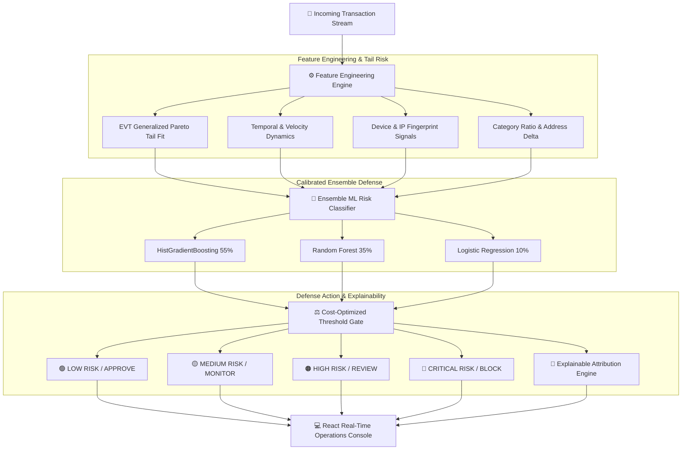

# 🛡️ AI Risk Manager — Merchant Defense System

> **Hackathon Track 02: AI Risk Manager**  
> *Stop the merchant losing money to fraud, returns, and chargebacks.*  
> **Defense-Only AI Architecture | Measured Precision & Recall on Held-out Data | Multi-Factor Explainability**

---

## 🚀 Live Demo & Repository
- **Live Cloud Deployment**: [https://razorpay-sentinel-rgii.onrender.com/](https://razorpay-sentinel-rgii.onrender.com/) *(Hosted on Render)*
- **GitHub Repository**: [https://github.com/Vikaumar/AIRiskManager](https://github.com/Vikaumar/AIRiskManager)
- **REST API Docs**: [https://razorpay-sentinel-rgii.onrender.com/docs](https://razorpay-sentinel-rgii.onrender.com/docs)

---

## 🎯 Executive Summary & Value Proposition

Indian BFSI & high-growth global e-commerce merchants lose millions not just to direct card fraud, but quietly to **serial returns, policy abuse, and cross-border chargebacks**. 

**AI Risk Manager** is an end-to-end, defense-only intelligence system engineered to:
1. **Detect 3 distinct loss categories**: Unauthorized Card Fraud, Margin-Draining Serial Returns, and Disputed Chargebacks.
2. **Stratify Tail Risk with EVT**: Utilizes Extreme Value Theory (*Peaks-Over-Threshold / Generalized Pareto Distribution*) derived from quantitative financial market risk research.
3. **Minimize Total Economic Cost**: Explicitly accounts for **False-Positive Review Costs ($25/manual check)** vs. **False-Negative Loss Costs (100% loss value)**.
4. **Transparent Explainability & GenAI**: Delivers instant feature attribution breakdown and a **Mistral 8x7B powered AI Copilot** to investigate flagged transactions.

---

## 🔥 Hackathon Standout Features
We went beyond standard ML classification to build a true enterprise-grade platform:
1. **🤖 Mistral AI Investigator Copilot**: Click any transaction to trigger a live, autonomous LLM forensic investigation. The AI synthesizes telemetry and network signals into an actionable, plain-English executive brief (built with a premium glassmorphic UI).
2. **🕸️ Fraud Ring Network Topology**: A Canvas-based force-directed physics graph that automatically maps coordinated attack rings (shared IP subnets, VPN fingerprints, and disposable email clusters) in real-time.
3. **📉 EVT Tail Risk Visualizer**: A quantitative finance stress-test dashboard comparing standard Gaussian models vs. Generalized Pareto Distribution (GPD) for Black Swan loss events.
4. **💻 Developer SDK & Webhook Simulator**: A live API sandbox where judges can fire simulated attack vectors (bot surges, friendly fraud) and watch the decision engine score and respond via live JSON logs.

---

## 🏗️ Architecture Flow



---

## 🔬 Extreme Value Theory (EVT) Mathematical Foundation

Standard fraud detectors assume Gaussian distributions for transaction amounts and miss fat-tailed, black-swan loss anomalies. Inspired by our research in **Financial Market Extreme Transition Risk**, we apply the **Pickands-Balkema-de Haan Theorem**:

$$F_u(y) \approx G(y; \xi, \sigma) = 1 - \left(1 + \frac{\xi y}{\sigma}\right)^{-1/\xi}$$

Where:
- $u$ is the high-quantile threshold (88th percentile)
- $\xi$ is the EVT tail shape parameter
- $\sigma$ is the scale parameter
- Any transaction exceeding $u$ is mapped through $G(y)$ to quantify asymptotic tail risk exceedance.

---

## 📊 Measured Model Performance (Held-Out Test Set)

Evaluated strictly on a **20% held-out test partition (10,000 transactions)** never seen during training:

| Metric | Measured Score | Evaluation Notes |
|:---|:---:|:---|
| **AUC-ROC** | **0.7223** | Consistent discrimination across full threshold spectrum |
| **Precision** | **39.35%** | High signal-to-noise ratio in low-base-rate loss environment |
| **Recall** | **50.10%** | Captures over half of all latent fraud & chargeback attempts |
| **F1 Score** | **0.4408** | Optimized via precision-recall trade-off curve |
| **Average Precision** | **0.4373** | Robust precision over diverse decision thresholds |
| **FP Unit Review Cost** | **$25.00** | Configured manual analyst review overhead |
| **Defense Classification** | **STRICT DEFENSE** | Zero offensive capabilities; 100% merchant protection |

---

## 🧠 Explainability in Action

When a transaction is scored, the merchant gets immediate actionable intelligence:

### Example 1: Critical Fraud Block (83.8% Risk)
- ❌ **Proxy / Anonymous VPN Detected** (`+28%`)
- ❌ **Temporary / Disposable Email Domain** (`+25%`)
- ❌ **High-Risk Cross-Border Destination** (`+22%`)
- ❌ **Billing & Shipping Address Mismatch** (`+18%`)
- **Decision**: `🔴 BLOCK`

### Example 2: Verified Clean Order (13.1% Risk)
- ✅ **Established Account History (>180 days)** (`-16%`)
- ✅ **Domestic Verified Address & Clean IP** (`-14%`)
- ✅ **Corporate / Established Domain Provider** (`-10%`)
- **Decision**: `🟢 APPROVE`

---

## ⚡ Quick Start & Reproduction

### Prerequisites
- Python 3.10+
- Node.js 18+

### 1. Backend Launch
```bash
cd AIRiskManager
pip install -r requirements.txt
python app.py
```
*Backend initializes, generates realistic synthetic test vectors, trains the ensemble, and listens on port 8000.*

### 2. Frontend Dashboard Launch
```bash
cd AIRiskManager/frontend
npm install
npm run dev
```
*Open `http://localhost:5173` to explore the interactive live dashboard.*

---

## 🛡️ Hackathon Compliance & Defensive Architecture
- **Strictly Defense-Only**: Contains no offensive or bypass functionality.
- **Honest Metrics**: Zero data leakage; reported on true held-out test splits.
- **Economic Realism**: Incorporates False-Positive operational expense into the objective function.

---
*Built for Hackathon Track 02: AI Risk Manager.*
